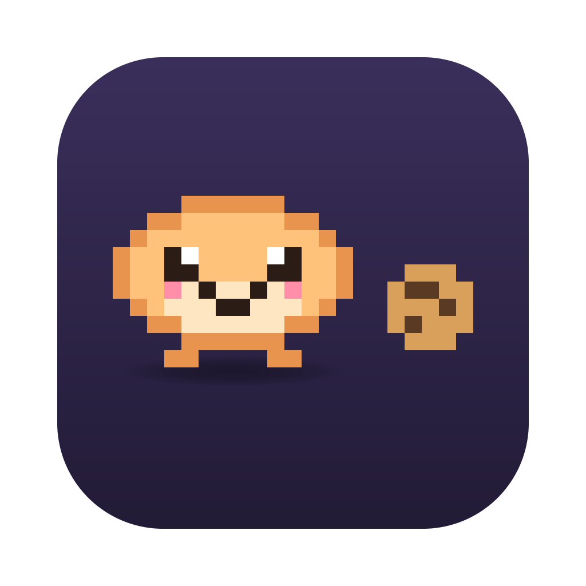

<p align="center"></p>

<h1 align="center">chud</h1>

<p align="center"><b>Run Claude Code and Copilot CLI sessions side by side, and see at a glance which one needs you.</b></p>

With several coding agents going at once, you end up tab-hopping to check which one finished, which one is asking a question, and how much of your plan you've burned. chud is a small terminal multiplexer, written in Rust, built for exactly that. Every session sits in a sidebar with its live status. You get a notification when an agent is done or waiting on you. And each agent has a pixel **chud** (slang for someone who eats a lot) that gets fatter the longer it works.

It runs as a TUI inside any terminal, or as its own macOS app with bundled fonts.

## Key features

| | |
|---|---|
| **Live agent status** | Working, needs input, done, or exited, for Claude Code and Copilot CLI. It also picks up agents you start by hand inside a shell session. |
| **Notifications & unread markers** | A macOS notification when an agent finishes or asks for input; a marker on sessions you haven't looked at since. |
| **Plan usage header** | Claude's rolling 5-hour limit with a reset countdown plus the weekly %, or Copilot's monthly premium requests. |
| **Context fullness** | Per-session bar in the sidebar showing how full each agent's context window is. |
| **Groups** | Put sessions in named, foldable groups; drag sessions to reorder or regroup them. |
| **Dashboard** | Summary page with token charts, working time, and every agent's chud. |
| **Diff review** | See the repo's changed files, then commit or discard without leaving chud. |
| **Copy and paste** | Drag over the terminal to select and copy; ⌘V pastes. `C-a y` copies the whole session view. |
| **Mouse-first UI** | Toolbar, `…` and right-click menus, drag and drop, resizable sidebar. Every action also has a keyboard shortcut. |
| **Restore on restart** | Layout, groups, names and agent chats come back the next time you run `chud`. |
| **Fast & idle-friendly** | Draws only when something changes; release builds use fat LTO. |

## Installation

### Prerequisites

- macOS. That's what chud is built and tested on, and the app bundle is macOS-only.
- [Rust](https://rustup.rs) 1.85 or newer (the crates use edition 2024).
- [Claude Code](https://docs.anthropic.com/en/docs/claude-code) and/or [GitHub Copilot CLI](https://github.com/github/copilot-cli).
- Optional: the [GitHub CLI](https://cli.github.com) (`gh`), logged in, for the Copilot quota in the header.

### 1. Build and install

```sh
git clone https://github.com/ZingZing001/chud.git
cd chud
./bundle.sh          # builds everything and installs ~/Applications/chud.app
```

Re-run [`bundle.sh`](bundle.sh) after any code change. If you only want the terminal version:

```sh
cargo install --path .   # puts `chud` in ~/.cargo/bin
```

### 2. Let chud see Claude's status

Claude Code reports its status through the `claude-code-warp` plugin, which chud listens for:

```sh
claude plugin marketplace add warpdotdev/claude-code-warp
claude plugin install warp@claude-code-warp
```

Copilot CLI needs no setup.

### 3. Show Claude's 5-hour limit (optional)

Add a status line to `~/.claude/settings.json`. After each reply, Claude Code hands chud your plan limits:

```json
{
  "statusLine": {
    "type": "command",
    "command": "~/Applications/chud.app/Contents/MacOS/chud --statusline"
  }
}
```

Use `~/.cargo/bin/chud --statusline` if you installed with `cargo install`. This also gives every Claude Code session a one-line footer like `5h 23% · week 41%`, which replaces Claude's default key hints. The limits only appear on Claude Pro/Max plans, starting from the first reply.

## Usage

Open **chud** from `~/Applications` (or `open -a chud`), or run it in any terminal:

```sh
chud                    # restore your last layout (or start a zsh session)
chud claude copilot     # open these sessions instead
chud "claude --model opus" zsh
```

Drag across the terminal to select text — letting go copies it, and ⌘V pastes it back.

New sessions start in zsh; launch `claude` or `copilot` inside them and chud picks the agent up. Use **+ New ▾** in the toolbar for a new terminal or group. Click a session to switch, right-click it (or its `…`) for its menu, and drag it to move it.

Every shortcut starts with the `Ctrl-a` prefix:

| Keys | Action |
|---|---|
| `C-a n` | New terminal (zsh) in this group |
| `C-a j` / `k` / `1`–`9` | Next / previous / nth session |
| `C-a Tab` | Jump to the next session that needs you |
| `C-a r` | Rename session (empty = automatic name from the chat title) |
| `C-a g` / `G` | Move session to a group / rename its group |
| `C-a z` | Fold / unfold this group |
| `C-a J` / `K` | Move session down / up |
| `C-a y` | Copy what this session shows to the clipboard |
| `C-a v` | Hand the mouse to the terminal (holding ⌥ does the same) |
| `C-a f` | Zoom: hide or show the sidebar |
| `C-a d` | Diff review (`c` commit, `r` discard, `R` refresh) |
| `C-a s` | Dashboard |
| `C-a x` | Kill session |
| `C-a q` | Quit (running `chud` again restores everything) |
| `C-a C-a` | Send a literal `Ctrl-a` |

In chud.app the usual ⌘ shortcuts work too: ⌘T new session, ⌘W kill it, ⌘1–⌘9 to jump, ⌘+/⌘−/⌘0 for text size, and ⌘V paste.

`C-a ?` or the **Help** button shows this list in the app. chud keeps its state in `~/.config/chud/`.

## Contributing

Contributions are welcome. For anything bigger than a small fix, open an issue first so we can agree on the approach.

1. Fork the repo and create a branch.
2. Make your change. Keep diffs small and match the surrounding style.
3. Check it:
   ```sh
   cargo test --workspace
   cargo clippy --workspace
   ./bundle.sh               # try the app for real
   ```
4. Open a pull request that says what changed and how you tested it.

Where things live:

| Path | What's there |
|---|---|
| [`src/main.rs`](src/main.rs) | App state, input handling, save/restore |
| [`src/ui.rs`](src/ui.rs) | All drawing: sidebar, header, dashboard, menus |
| [`src/session.rs`](src/session.rs) | PTYs, agent detection and status parsing |
| [`src/usage.rs`](src/usage.rs) | Token usage from agent logs, plan limits |
| [`src/chud.rs`](src/chud.rs) | The pixel chud |
| [`src/git.rs`](src/git.rs) | Diff review and commits |
| [`app/`](app/) | The macOS window ([iced](https://iced.rs) + [iced_term](https://github.com/Harzu/iced_term)), icon, fonts |
| [`fixtures/`](fixtures/) | Raw terminal recordings of real Claude and Copilot sessions |

To redraw the app icon, run `python3 app/icon.py`.

## License

No license has been chosen yet, so all rights are reserved for now. A `LICENSE` file will be added when that changes.

The bundled fonts, Fira Code Nerd Font and Noto Sans Symbols 2, are under the SIL Open Font License 1.1. See [`app/fonts/OFL-FiraCode.txt`](app/fonts/OFL-FiraCode.txt) and [`app/fonts/OFL-NotoSansSymbols2.txt`](app/fonts/OFL-NotoSansSymbols2.txt).
